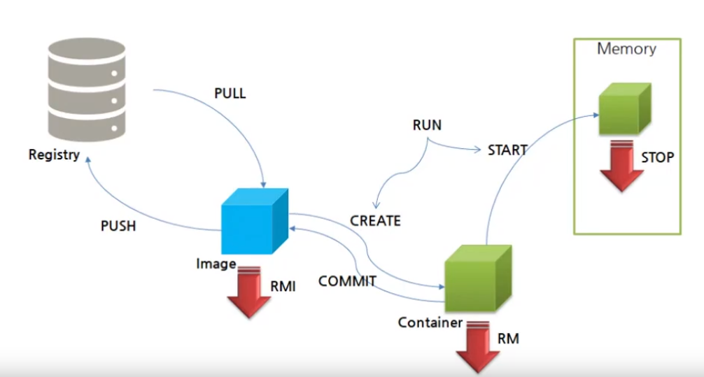

#### 도커(docker)

- 컨테이너 기술을 지원하는 다양한 프로젝트 중 하나지만 컨테이너 기술을 이전에도 있었으나 도커로 인해 알려졌고, 사실상 표준 역할을 한다.
- 다양한 운영체제(Mac, Linux, Window)에서 사용이 가능하다
- 애플리케이션에 국한되지 않고 의존성 및 파일시스템까지 패키징하여 빌드, 배포, 실행을 단순화
- 리눅스의 네임스페이스와 cgruops와 같은 커널 기능을 사용하여 가상화하였다.
  - Namespace
    - 한덩어리의 데이터에 이름을 붙여 충돌 가능성을 줄이고, 쉽게 참조할 수 있게하는 개념
    - Linux 커널의 Namespace 기능은, Linux 오브젝트에 이름을 붙임으로써 6개의 독립된 환경을 구축했다.
    - 
    |환경|Description|
    |---|---|
    |PID namespace|PID를 통해 프로세스를 격리시키며, namespace가 다른 프로세스는 서로 액세스할 수 없다.|
    |Network namespace|IP, Port, 라우팅 테이블 등 네트워크 리소스를 namespace마다 격리 시켜 독립적으로 가질 수 있다. 이 기능을 통해 Port가 사용중이여도 컨테이너 안에서 동일한 Port를 사용할 수 있다.|
    |UID namespace|UID, GID를 namespace 별로 독립적으로 가질 수 |
    |Mount namespace|서로 다른 격리된 파일시스템 트리를 가질 수 있다.|
    |UTS namespace|namespace 별로 호스트 명이나 도메인 명을 독자적으로 가질 수 있다.|
    |IPC namespace|프로세스 간 통신 오브젝트를 namespace 별로 독립적으로 가질 수 있다.|
    
  - CGROUP
    - control group의 약자로, 사용자에게 CPU 시간, 시스템 메모리, 네트워크 대역폭과 같은 자원이나 이런 자원의 조합을 시스템에서 실행중인 프로세스간에 할당한다.
  
- VM과 컨테이너
  - VM과 비교했을 때, VM에 경우 Hypervisor 위에 OS를 따로 두고 있어 큰 오버헤드를 갖고 있다.
  - 컨테이너가 해결
    - 도커는 동일 시스템에서 실행하는 소프트웨어의 컴포넌트가 충돌하거나 다양한 종속성을 가지고 있다.
    - 컨테이너는 가상 머신을 사용해 각 마이크로서비스를 격리한다.
    - 컨에이너는 가상머신처럼 하드웨어를 전부 구현하지 않기 때문에 매우 빠른 실행 가능
    - 프로세스의 문제가 발생할 경우 컨테이너 전체를 조정해야 하기 때문에 컨테이너에 하나의 프로세스를 실행하도록 하는 것이 좋다.
  
  
- 도커는 클라우드 서비스 모델과 같이 사용 가능
  - 이미지: 필요한 프로그램과 라이브러리, 소스를 설치한 뒤 만든 하나의 파일
  - 컨테이너: 이미지를 격리하여 독립된 공간에서 실행한 가상 환경

- 도커의 한계
  - 서비스가 커질수록 관리해야 하는 컨테이너의 양이 급격히 증가하여 관리하기 쉽지 않다.
  - 배포 및 컨테이너 배치 전략
  - Scale in, Scale out이 어렵다.

#### 도커 설치

- 환경: Ubuntu: 18.0.4.2, linux
  ```
  root@server1-VirtualBox:~# cat /etc/lsb-release
  DISTRIB_ID=Ubuntu
  DISTRIB_RELEASE=18.04
  DISTRIB_CODENAME=bionic
  DISTRIB_DESCRIPTION="Ubuntu 18.04.2 LTS"
  ```
  
- 도커 설치
  ```
  $ apt install docker.io
  ```
  
- 도커 설치 확인
  ```
  $ docker -v
  ```
  - 버전을 확인하여 도커 설치 여부를 알 수 있다.

- 도커 이미지 다운로드 후 이미지 생성
  - 도커 이미지 찾기
    ```
    $ docker search tomcat
    ```
  - 이미지 실행
    ```
    $ docker run -d -p 8080:8080 --name console/tomcat-7.0
    ```
    - -d: 백그라운드 실행
    - -p: inbound port : outbound port
    - --name: 이름을 설정할 수 있다.
  - 설치 후 127.0.0.1:8080을 접속하면 tomcat 시작되는 것을 확인할 수 있다.

#### 도커 레지스트리(hub)

- 도커 레지스르리에는 사용자가 사용할 수 있도록 데이터베이스를 통해 image를 제공하고 있다.
- 누구나 이미지를 만들어 푸시할 수 있으며 푸시된 이미지는 다른 사람들에게 공유 가능하다.

- 이미지 찾기
  - 명령어로 CLI 형태로 찾을 수 있다.
    ```
    $ sudo docker search tomcat
    ```
  - docker hub 사용하기
    - https://hub.docker.com/
    - 보통 이름/이미지이름 으로 되어 있다.
    
- hub에서 다운로드
  - 이미지 다운로드
    ```
    $ docker pull mysql
    ```
  - 이미지 다운로드 + 실행
    ```
    $ docker run -d -p 8080:8080 --name console/tomcat-7.0
    ```
  - 이미지 확인
    ```
    $ docker images
    ```

#### 도커 라이프사이클

- 라이프 사이클 이해
  

  |command|description|
  |---|---|
  |pull|registry에서 image를 다운받는다.|
  |push|image를 registry에 저장한다.|
  |rmi|image를 삭제한다.|
  |create|image를 container로 생성한다.|
  |commit|container를 새로운 image로 다시 만든다.|
  |rm|container를 삭제한다.
  |start|container를 실행한다.(메모리에 올린 후 동작)|
  |stop|memory에 올려둔 container를 중단한다.|
  |run|pull + create + start로 이미지를 다운 받고, 컨테이너로 만들고 실행한다.|

  - push에는 권한이 필요하다.
  - run을 할 때 이미지가 이미 존재한다면 pull을 하지는 않는다.
  - 컨테이너는 create, run할 때마다 다른 컨테이너로 생성된다. 이미 사용하는 컨테이너가 있는 경우 start를 하는 것이 좋다.
  - 만약, window 컨테이너에 여러 어플리케이션을 다운받은 후 commit하면 해당 어플리케이션까지 포함된 새로운 이미지를 만들 수 있다. 

- 명령어
  - registry로부터 이미지 다운받기
    ```
    $ sudo docker pull nginx
    ```
  - 이미지 확인하기
    ```
    $ sudo docker images
    ```
  - 이미지 삭제하기
    ```
    $ sudo docker rmi tomcat
    ```
  - 이미지 컨테이너로 만들기
    ```
    $ sudo docker create -p 80:80 --name nx nginx
    ```
    - 80번 포트로, nx라는 이름으로 컨테이너 생성
  - 컨테이너 실행하기
    ```
    $ sudo docker start {container_id | container_name}
    ```
  - run nginx 컨테이너: pull + create + start
    ```
    $ sudo docker run -d -p 81:80 --name nx2 nginx
    ```
    - container 이름이나 포트번호 등이 같으면 실행 오류 발생
    - container 이름과 포트를 같게 하면 새로운 컨테이너가 생성되고 실행된다.
  - 실행중인 컨테이너 확인
    ```
    $ sudo docker ps
    ```
  - 모든 컨테이너 확인
    ```
    $ sudo docker ps -a    
    ```
  - 컨테이너 중지
    ```
    $ sudo docker stop {container_id | container_name}
    ```
  - 컨테이너 삭제
    - 컨테이너가 중지되어야 삭제가 가능하다.
    ```
    $ sudo docker rm {container_id | container_name}
    ```
  - 컨테이너 재시작
    ```
    $ sudo docker restart {container_id | container_name}
    ```
    
    
