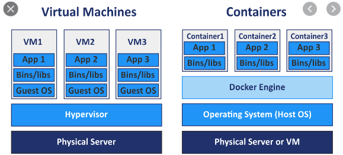

#### 도커(docker)

- 컨테이너 기술을 지원하는 다양한 프로젝트 중 하나지만 컨테이너 기술을 이전에도 있었으나 도커로 인해 알려졌고, 사실상 표준 역할을 한다.
- 다양한 운영체제(Mac, Linux, Window)에서 사용이 가능하다
- 애플리케이션에 국한되지 않고 의존성 및 파일시스템까지 패키징하여 빌드, 배포, 실행을 단순화
- 리눅스의 네임스페이스와 cgruops와 같은 커널 기능을 사용하여 가상화하였다.
  - Namespace
    - 한덩어리의 데이터에 이름을 붙여 충돌 가능성을 줄이고, 쉽게 참조할 수 있게하는 개념
    - Linux 커널의 Namespace 기능은, Linux 오브젝트에 이름을 붙임으로써 6개의 독립된 환경을 구축했다.
    - 
    |환경|Description|
    |---|---|
    |PID namespace|PID를 통해 프로세스를 격리시키며, namespace가 다른 프로세스는 서로 액세스할 수 없다.|
    |Network namespace|IP, Port, 라우팅 테이블 등 네트워크 리소스를 namespace마다 격리 시켜 독립적으로 가질 수 있다. 이 기능을 통해 Port가 사용중이여도 컨테이너 안에서 동일한 Port를 사용할 수 있다.|
    |UID namespace|UID, GID를 namespace 별로 독립적으로 가질 수 |
    |Mount namespace|서로 다른 격리된 파일시스템 트리를 가질 수 있다.|
    |UTS namespace|namespace 별로 호스트 명이나 도메인 명을 독자적으로 가질 수 있다.|
    |IPC namespace|프로세스 간 통신 오브젝트를 namespace 별로 독립적으로 가질 수 있다.|
    
  - CGROUP
    - control group의 약자로, 사용자에게 CPU 시간, 시스템 메모리, 네트워크 대역폭과 같은 자원이나 이런 자원의 조합을 시스템에서 실행중인 프로세스간에 할당한다.
  
- VM과 컨테이너
  - VM과 비교했을 때, VM에 경우 Hypervisor 위에 OS를 따로 두고 있어 큰 오버헤드를 갖고 있다.
  - 컨테이너가 해결
    - 도커는 동일 시스템에서 실행하는 소프트웨어의 컴포넌트가 충돌하거나 다양한 종속성을 가지고 있다.
    - 컨테이너는 가상 머신을 사용해 각 마이크로서비스를 격리한다.
    - 컨에이너는 가상머신처럼 하드웨어를 전부 구현하지 않기 때문에 매우 빠른 실행 가능
    - 프로세스의 문제가 발생할 경우 컨테이너 전체를 조정해야 하기 때문에 컨테이너에 하나의 프로세스를 실행하도록 하는 것이 좋다.
  
  
- 도커는 클라우드 서비스 모델과 같이 사용 가능
  - 이미지: 필요한 프로그램과 라이브러리, 소스를 설치한 뒤 만든 하나의 파일
  - 컨테이너: 이미지를 격리하여 독립된 공간에서 실행한 가상 환경

- 도커의 한계
  - 서비스가 커질수록 관리해야 하는 컨테이너의 양이 급격히 증가하여 관리하기 쉽지 않다.
  - 배포 및 컨테이너 배치 전략
  - Scale in, Scale out이 어렵다.
    
#### 도커 설치

