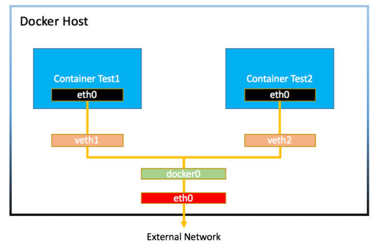

#### 도커 네트워크 구조

- 도커 컨테이너 내부에서 ifconfig를 입력하면 컨테이너의 네트워크 인터페이스에 eht0과 lo 네트워크 인터페이스가 있는 것을 확인할 수 있다.
- 도커는 컨테이너에 내부 IP를 순차적으로 할당하며, 이 IP는 컨테이너를 재시작할 때마다 변경될 수 있다.
- 내부 IP는 도커가 설치된 호스트, 즉 내부 망에서만 사용할 수 있는 IP이기 때문에 외부와 연결될 필요가 있다.
  - 이 과정은 veth(virtual ethernet)이라는 네트워크 인터페이스를 생성함으로써 이뤄집니다.
  - 도커는 각 컨테이너에 외부와의 네트워크를 제공하기 위해 컨테이너마다 가상 네트워크 인터페이스를 호스트에 생성하며 이 인터페이스의 이름은 veth로 시작한다.
  - veth 인터페이스는 사용자가 직접 생성할 필요가 없으며, 컨테이너가 생성될 때 도커 엔진이 자동으로 생성한다.
  - 도커가 설치된 호스트에서 ifconfig, if addr 명령으로 확인할 수 있다.
- veth 인터페이스 뿐 아니라 docker0라는 브릿지도 존재하여 각 veth 인터페이스와 바인딩 돼 호스트의 eth0 인터페이스와 이어주는 역할을 한다.

(출처: https://joont92.github.io/docker/network-%EA%B5%AC%EC%A1%B0/)

#### 도커 네트워크 기능

- 컨테이너를 생성하면 기본적으로 docker0 브리지 외에 여러 네트워크 드라이버를 사용할 수 있다.
  - 도커 제공: bridge, host, none, container, overlay 등이 있다.
  - third party 플러그인 솔루션: weave, flannel, openvswitch 등이 있다.
  
- 도커에서 기본적으로 사용할 수 있는 네트워크 종류 알아보기
  ```
  $ docker network ls
  ```
- 네트워크 자세한 정보 살펴보기
  ```
  $ docker network inspect
  $ docker inspect --type network
  ```
  - Config 항목의 서브넷과 게이트웨이의 설정을 알 수 있다. 
  - 브릿지 네트워크를 사용중인 컨테이너의 목록을 Containers 항목에서 확인할 수 있다.
  
- 브릿지 네트워크
  - 브릿지 네트워크 생성하기
    ```
    $ docker network create --driver bridge mybridge
    ```
  - docker run or docker create 시 네트워크 설정
    ```
    $ docker run -i -t --name mynetwork_container \
    --net mybridge \
    ubuntu:14.04
    ```
  - 브릿지 네트워크와 컨테이너에 유동적으로 붙이고 뗄 수 있다.
    ```
    $ docker network disconnect mybridge mynetwork_container
    $ docker network connect mybridge mynetwork_container
    ```
    - 브릿지 네트워크와 오버레이 네트워크 같이 특정 IP 대역을 갖는 네트워크 모드에만 해당 명령어를 사용할 수 있다.
    - none 네트워크, host 네트워크에서는 사용할 수 없다.
  - 네트워크의 서브넷, 게이트웨이, IP 할당 범위 등을 임의로 설정하기 위해서는 --subnet, --ip-range, --gateway 옵션을 추가할 수 있다.
    ```
    $ docker network create --driver=bridge \
    --subnet=172.72.0.0/16 \
    --ip-range=172.72.0.0/24 \
    --gateway=172.72.0.0.1 \
    my_custom_network
    ```
    - subnet과 ip-range, gateway는 같은 대역이어야 한다.
    
- 호스트 네트워크
  - 네트워크를 호스트로 설정하면 호스트의 네트워크 환경을 그대로 사용할 수 있다.
  - 호스트 네트워크 사용하기
    ```
    $ docker run -i -t --name mynetwork_host \
    --net host \
    ubuntu:14.0.4
    ```
    - 호스트 이름은 도커 엔진이 설치된 호스트 머신의 호스트 이름으로 설정된다.
    - 컨테이너의 네트워크를 호스트 모드로 설정하면 컨테이너 내부의 애플리케이션을 별도의 포트 포워딩 없이 바로 서비스할 수 있다.
    
- 논 네트워크
  - none은 말 그대로 아무런 네트워크를 쓰지 않는 것을 뜻한다.
  - 다음과 같이 사용하면 컨테이너는 외부 연결이 단절된다.
  ```
  $ docker run -i -t --name network_none \
  --net none \
  ubuntu:14.04
  ```
  
- 컨테이너 네트워크
  - --net 옵션에 container를 입력하면 다른 컨테이너의 네트워크 네임스페이스 환경을 공유할 수 있다.
  - 공유되는 속성은 내부 IP, 네트워크 인터페이스의 MAC 주소 등이다.
  - --net 옵션의 값으로 container:[컨테이너 ID]와 같이 입력한다.
  ```
  $ docker run -i -t -d --name network_container1 ubuntu:14.04
  $ docker run -i -t -d --name network_container2 \
  --net container:network_container1 \
  ubuntu:14.0.4
  ```
  - network_container1의 네트워크와 관련된 사항은 전부 network_container2와 같게 설정된다.
    ```
    $ docker exec network_container1 ifconfig
    $ docker exec network_container2 ifconfig
    ```
    - 해당 명령어로 확인할 수 있다.

- 출처: https://joont92.github.io/docker/network-%EA%B5%AC%EC%A1%B0/
- 출처: 시작하세요. 도커/쿠버네티스 
