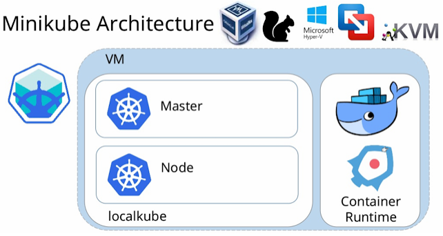
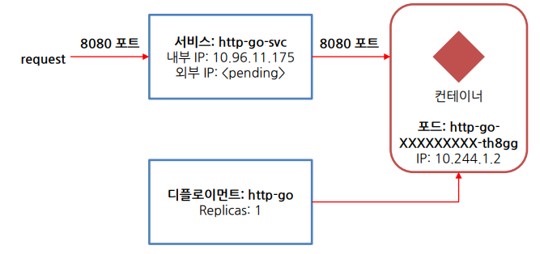

#### Minikube를 설치하기 전에

- 미니큐브는 가상환경을 사용하여 쿠버네티스 클러스터를 가상으로 구현한다.
- 경량화된 환경으로, 테스트 등에 사용할 수 있다.

#### Minikube 설치 

- 도커 설치
  - 우분투 환경에서 도커 설치
    ```
    $ sudo apt install docker.io -y
    ```
  - sudo 없이, 일반 사용자가 docker를 사용할 수 있도록 권한 수정
    ```
    $ sudo usermod -aG docker $USER && newgrp docker
    ```

- Minikube 다운로드 및 설치
  - 환경마다 설치 방법이 다르다. 해당 방법은 우분투 환경에서 설치
    ```
    $ curl -LO https://storage.googleapis.com/minikube/releases/latest/minikube_latest_amd64.deb
    sudo dpkg -i minikube_latest_amd64.deb
    ```
    
- Minikube 실행
  - Minikube 내에서도 도커 환경을 사용할 예정이기 때문에 --driver에 docker를 전달한다.
    ```
    $ minikube start --driver=docker
    ```
  - ubuntu 재시작 후, minikube가 실행되지 않는다. 위에 명령으로 다시 실행해야 한다.

- Minikube 접속
  - minikube에 클라이언트로 접속하는 간단한 방법은 kubectl을 사용하는 것이다.
  - snap을 통해 kubectl을 설치한다.
    ```
    $ sudo snap install kubectl --classic
    ```
  - kubectl 설치 확인
    ```
    $ kubectl get nodes
    ```
    
- Minikube에 SSH로 접속
  - minikube는 가상의 노드를 하나 만들고 그 안에 쿠버네티스 시스템을 구축하는 형태로 돌아간다. 
  - 도커를 조회하는 명령을 내리면 하나의 도커가 도는 모습이 보인다. 
  - 사실 쿠버네티스 클러스터는 모든 컴포넌트가 컨테이너 형태로 돌아가기 때문에 원래는 다수의 컨테이너가 보여야 한다.
    ```
    server1@server1-VirtualBox:~$ docker ps
    CONTAINER ID        IMAGE                                 COMMAND                  CREATED             STATUS              PORTS                                                                                                                                  NAMES
    1dc7c9efa5f9        gcr.io/k8s-minikube/kicbase:v0.0.18   "/usr/local/bin/entr…"   6 hours ago         Up 26 minutes       127.0.0.1:32772->22/tcp, 127.0.0.1:32771->2376/tcp, 127.0.0.1:32770->5000/tcp, 127.0.0.1:32769->8443/tcp, 127.0.0.1:32768->32443/tcp   minikube
    ```
  - 이 도커 컨테이너가  가상으로 떠있는 노드다. 접속해서 내용을 확인하자. 
  - 노드에 접속하는 방법은 minikube 명령을 사용하기 바란다. minikube ssh 명령을 실행하면 minikube 셸이 떨어진다.
    ```
    server1@server1-VirtualBox:~$ minikube ssh
    docker@minikube:~$
    ```
  - exit 명령으로 접속 해지할 수 있다.

- Minikube Architecture

  
  - 이미지 출처: https://blog.codonomics.com/2019/02/loadbalancer-support-with-minikube-for-k8s.html

  - ubuntu 내에 docker 를 만들었고, minikube 컨테이너를 생성했다.
  - minikube내에 docker를 활용하여 kubectl에 필요한 컨테이너를 실행한 것

#### 쿠버네티스에 Spring boot 컨테이너 올리기

- Spring Boot Application 이미지 생성 및 컨테이너 실행, Docker hub로 push

  - Dockerfile 작성
    ```
    FROM openjdk:9-=
    ARG JAR_FILE=./*.jar
    COPY ${JAR_FILE} app.jar
    ENTRYPOINT ["java", "-jar", "./app.jar"]
    ```
  - 확인하기
    ```
    root@Master:/test# ls
    Dockerfile  KubernetesTest.jar   
    ```
  - 빌드하기
    ```
    $ root@Master:/test# docker build -t test .
    $ root@Master:/test# docker images
    REPOSITORY                           TAG                 IMAGE ID            CREATED              SIZE
    demo/test                            latest              afa3b1837de4        About a minute ago   122MB
    openjdk                              8-jdk-alpine        a3562aa0b991        22 months ago        105MB
    ```
    - java 실행 파일인 openjdk와 demo/test가 생성되었다.

  - 컨테이너 생성하기
    ```
    root@Master:/test# docker run -d -p 8080:8080 --name test demo/test
    2b2ec8ed403aabf6a6ab08b667ddfd5b45ca0215be04b55fe2cc653dced7261d
    root@Master:/test# docker ps 
    CONTAINER ID        IMAGE                  COMMAND                  CREATED             STATUS              PORTS                         NAMES
    2b2ec8ed403a        demo/test              "java -jar ./app.jar"    35 seconds ago      Up 33 seconds       0.0.0.0:8080->8080/tcp   test
    ```
  - 접속 확인하기
    ```
    localhost:8080/hello
    ```
  - 도커 허브에 push
    ```
    $ docker login
    $ docker tag demo/test devtak/test:v1.0
    $ docker push devtak/test:v1.0
    ```
    - denied-requested-access-to-the-resource-is-denied-docker 오류
      - 참고: https://stackoverflow.com/questions/41984399/denied-requested-access-to-the-resource-is-denied-docker
      - 해결 방법1. 정상 로그인을 해야 한다.
      - 해결 방법2. docker hub 레퍼지토리에 맞는 tag를 주어야 한다.
        ```
        $ docker login
        <enter user name and password for Docker Hub Repository>
        $ docker tag first-image {docker-hub-username}/{default-repo-folder-name}:first-image
        $ docker push {docker-hub-username}/{default-repo-folder-name}:first-image
        ```

- Kubernetest 앱 실행하기
  - 보통 배포하려는 모든 컴포넌트의 설명이 기술된 JSON 또는 YAML 매니페스트 준비 필요
  - 이를 위해서는 쿠버네티스에서 사용되는 컴포넌트 유형을 잘 알아야 함
  - 여기서는 명령어에 몇 가지 옵션으로 디스크립션을 간단히 전달하여 한줄로 앱 실행
    ```
    $ kubectl create deploy test --image=devtak/test
    deployment.apps/test created
    ```
    - 생성한 deploy 확인하기 
      ```
      server1@Master:~$ kubectl get deploy
      NAME   READY   UP-TO-DATE   AVAILABLE   AGE
      test   0/1     1            0           49s
      ```
    - repllicaset 확인하기
      ```
      server1@Master:~$ kubectl get replicaset
      NAME              DESIRED   CURRENT   READY   AGE
      test-86bb8685b7   1         1         0       92s
      ```

  - 포드란?
    - 쿠버네티스는 kubectl get container와 같이 컨테이너를 취급하지 않는다.
    - 대신 여러 위치에 배치된 컨테이너 개념인 컨테이너 그룹으로 포드라는 개념을 사용한다.
      ```
      server1@Master:~$ kubectl get pod
      NAME                    READY   STATUS    RESTARTS   AGE
      test-86bb8685b7-r6q4z   0/1     Running   0          2m2s
      ```
    
  - 포드 특징
    - 포드는 하나 이상의 밀접하게 관련된 컨테이너로 구성된 그룹
    - 동일한 리눅스 네임스페이스와 동일한 워커 노드에서 항상 함께 실행
    - 각 포드는 애플리케이션을 실행하는 자체 IP, 호스트 이름, 프로세스 등이 있는 별도의 논리적 시스템
  
  - 잘못 만든 경우 삭제 (deploy, replicaset, pod 한번에 삭제 된다)
    ```
    server1@Master:~$ kubectl delete deploy test
    ```
    
  - 웹 애플리케이션 생성
    - 실행 중인 포드는 클러스터의 가상 네트워크에 포함돼 있음
    - 어떻게 액세스 할 수 있을까?
    - 외부에서 액세스하려면 서비스 객체를 통해 IP를 노출하는 것이 필요
    - Cloud 환경에서 여러개의 Node로 구축하는 경우
      - LoadBalancer라는 서비스를 작성하면 외부 로드 밸런서가 생성
      - 로드 밸런서의 공인 IP를 통해 포드에 연결 가능 (하지만 로컬 쿠버네티스에서는 동작하지 않으며 externalDNS가 필요함, 이 기능은 GKE, EKS 같은 클라우드에서 사용 가능(구글, AWS 계정 필요))
        ```
        server1@Master:~$ kubectl expose deployment test --name=test-svc --type=LoadBalancer --port=8080
        service/test-svc exposed
        server1@Master:~$ kubectl get svc
        NAME         TYPE           CLUSTER-IP       EXTERNAL-IP   PORT(S)          AGE
        kubernetes   ClusterIP      10.96.0.1        <none>        443/TCP          5d2h
        test-svc     LoadBalancer   10.107.156.154   <pending>     8080:31394/TCP   7s
        ```
        - deployment 하는 데 오래 걸린다.
          ```
          server1@Master:~$ kubectl get svc -w
          ```
          - 변경 사항을 모니터링 할 수 있다.
    
    - Minikube 단일 노드에 경우: NodePort 타입으로 서비스 생성
      ```
      server1@server1-VirtualBox:~$ kubectl expose deploy test --name=test-svc --port=8080 --type=NodePort
      ```
    - Service Type
      - ClusterIP
        - 서비스를 클러스터-내부 IP에 노출시킨다. 
        - 이 값을 선택하면 클러스터 내에서만 서비스에 도달할 수 있다. 
        - 이것은 ServiceTypes의 기본 값이다.
      - NodePort
        - 고정 포트 (NodePort)로 각 노드의 IP에 서비스를 노출시킨다. 
        - NodePort 서비스가 라우팅되는 ClusterIP 서비스가 자동으로 생성된다. 
        - <NodeIP>:<NodePort>를 요청하여, 클러스터 외부에서 NodePort 서비스에 접속할 수 있다.
      - LoadBalancer
        - 클라우드 공급자의 로드 밸런서를 사용하여 서비스를 외부에 노출시킨다. 
        - 외부 로드 밸런서가 라우팅되는 NodePort와 ClusterIP 서비스가 자동으로 생성된다.
      - ExternalName
        - 값과 함께 CNAME 레코드를 리턴하여, 서비스를 externalName 필드의 콘텐츠 (예:foo.bar.example.com)에 매핑한다. 
        - 어떤 종류의 프록시도 설정되어 있지 않다.
        
    - 서비스 삭제
      ```
      server1@Master:~$ kubectl delete svc test-svc
      ```
  
  - test 접근하기
    - Minikube에 IP 확인
      ```
      server1@server1-VirtualBox:~$ cat .kube/config
      apiVersion: v1
      clusters:
      - cluster:
          certificate-authority: /home/server1/.minikube/ca.crt
          extensions:
          - extension:
              last-update: Thu, 01 Apr 2021 23:05:32 KST
              provider: minikube.sigs.k8s.io
              version: v1.18.1
            name: cluster_info
          server: https://192.168.49.2:8443
        name: minikube
      contexts:
      - context:
          cluster: minikube
          extensions:
          - extension:
              last-update: Thu, 01 Apr 2021 23:05:32 KST
              provider: minikube.sigs.k8s.io
              version: v1.18.1
            name: context_info
          namespace: default
          user: minikube
        name: minikube
      current-context: minikube
      kind: Config
      preferences: {}
      users:
      - name: minikube
        user:
          client-certificate: /home/server1/.minikube/profiles/minikube/client.crt
          client-key: /home/server1/.minikube/profiles/minikube/client.key
      ```
    - 서비스에 노출된 포트로 접근
      ```
      server1@server1-VirtualBox:~$ curl 192.168.49.2:31601/hello
      hello docker
      ```
  
  - 동작 방식 이해
    
    - 사실 실제로 포드도 직접 만들지 않음
    - kubectl create deploy 명령을 실행하면 디플로이먼트가 생성
    - 디플로이먼트가 실제 포드 객체를 생성
    - 해당 디플로이먼트가 관리하는 포드의 포트 8080을 노출하라고 명령 필요
     
  - 디플로이먼트의 역할
    - 디플로이먼트는 레플리카셋을 생성
    - 레플리카셋은 수를 지정하여 알려주면 그 수만큼 포드를 유지
    - 어떤 이유로든 포드가 사라지면 레플리카셋은 누락된 포드를 대체할 새로운 포드를 생성

  - 서비스의 역할
    - 포드는 일시적이므로 언제든지 사라질 가능성 존재
    - 포드가 다시 시작되는 경우에는 언제든 IP와 ID 변경됨
    - 서비스는 변화하는 포드 IP 주소의 문제를 해결하고 단일 IP 및 포트 쌍에서 여러 개의 포드 노출
    - 서비스가 생성되면 정적 IP를 얻게 되고 서비스의 수명 내에서는 변하지 않음
    - 클라이언트는 포드에 직접 연결하는 대신 IP 주소를 통해 서비스에 연결
    - 서비스는 포드 중 하나로 연결을 포워딩

#### HTTP 서버 스케일링과 테스트

- 애플리케이션의 수평 스케일링
  - 쿠버네티스를 사용해 얻을 수 있는 큰 이점 중 하나는 간단하게 컨테이너의 확장이 가능하다는 점
  - 포드의 개수를 늘리는 것도 쉽게 가능
  - 포드는 디플로이먼트가 관리

  ```
  server1@Master:~$ kubectl scale deploy test --replicas=3
  deployment.apps/test scaled
  server1@Master:~$ kubectl get pod
  NAME                    READY   STATUS    RESTARTS   AGE
  test-86bb8685b7-gpntg   0/1     Running   0          5s
  test-86bb8685b7-gxbt7   0/1     Running   0          23m
  test-86bb8685b7-h85cl   0/1     Running   0          5s
  server1@Master:~$ kubectl get replicaset
  NAME              DESIRED   CURRENT   READY   AGE
  test-86bb8685b7   3         3         0       23m
  ```

- 직접 앱에 접근하기
  - curl을 통하여 loadbalancer 확인하기
    ```
    server1@Master:~$ kubectl exec test-86bb8685b7-gpntg -- curl 10.107.156.154:8080/hello -s
    ```

- 앱의 위치 확인
  ```
  server1@Master:~$ kubectl get pod -o wide
  ```

- 포드의 자세한 내용 살펴보기
  - 예정된 노드, 시작된 시간, 실행중인 이미지 등 유용한 정보 포함
    ```
    $ kubectl describe pod test-86bb8685b7-gpntg
    ```


** 출처: https://blog.naver.com/isc0304/221879359568

** 출처: 데브옵스(DevOps)를 위한 쿠버네티스 마스터 강의

** 미니큐브 공식 사이트: https://minikube.sigs.k8s.io/docs/start
