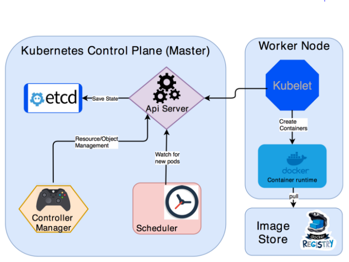

#### 쿠버네티스 아키텍처


- 이미지 출처: https://medium.com/@chkrishna/kubernetes-architecture-f7ca63fff46e

- Master Plain
  - Kube API Server
  - Kube Controller
  - Kube Scheduler
  - ETCD

#### 큐브 API 서버

- 쿠버네티스 시스템 컴포넌트는 오직 API 서버와 통신한다.
- 컴포넌트끼리 서로 직접 통신하지 않는다.
- ETCD와 통신하는 유일한 컴포넌트 API 서버
- RESTful API 를 통해 클러스터 상태를 쿼리, 수정할 수 있는 기능을 제공한다.

- 큐브 API 서버의 구체적인 역할
  - 인증 플러그인을 사용한 클라이언트 인증
  - 권한 승인 플러그인을 통한 클라이언트 인증
  - 승인 제어 플러그인을 통해 요청 받은 리소스를 확인/수정
  - 리소스 검증 및 영구 저장

#### 큐브 컨트롤러 매니저

- API 서버는 요청을 받기만 할 뿐 궁극적으로 아무 역할을 하지 않는다.
- 컨트롤러에는 다양한 컨트롤러가 존재한다.
- 해당 컨트롤러는 API 서버에 의해 받아진 요청을 처리하는 역할을 한다.
  - 레플리케이션 매니저(레플리케이션컨트롤러)
  - 레플리카셋, 데몬셋, 잡 컨트롤러
  - 디플로이먼트 컨트롤러
  - 스테이트풀셋 컨트롤러
  - 노드 컨트롤러
  - 서비스 컨트롤러
  - 엔드포인트 컨트롤러
  - 네임스페이스 컨트롤러
  - 영구 볼륨 컨트롤러
  - etc 등등

#### 큐브 스케줄러

- 일반적으로 실행할 노드를 직접 정해주지 않는다.
- 요청 받은 리소스를 어느 노드에 실행할지 결정하는 역할
- 현재 노드의 상태를 점검하고 최상의 노드를 찾아 배치
- 다수의 포드를 배치하는 경우에는 라운드로빈을 사용하여 분산

#### 쿠버네티스 주요 컴포넌트 확인하기

- 시스템 컴포넌트가 있는 이름으로 변경하여 pod을 확인
  ```
  server1@server1-VirtualBox:~$ kubectl get pod -n kube-system
  NAME                               READY   STATUS    RESTARTS   AGE
  coredns-74ff55c5b-sxvfj            1/1     Running   2          20h
  etcd-minikube                      1/1     Running   2          20h
  kube-apiserver-minikube            1/1     Running   2          20h
  kube-controller-manager-minikube   1/1     Running   3          20h
  kube-proxy-pdqqx                   1/1     Running   2          20h
  kube-scheduler-minikube            1/1     Running   2          20h
  storage-provisioner                1/1     Running   4          20h
  ```
  
#### 쿠버네티스 설정 파일 확인하기

- (Virtual Box만 가능) 일반적으로 리눅스에 설치하면 /etc/kubernetes/mainfest에 설정 파일 존재
- GCP의 경우 /home/Kubernetes/kube-manifests/Kubernetes/gci-trusty에 위치
  
- minikube 사용중이기 때문에 ssh로 접근하여 확인
  ```
  server1@server1-VirtualBox:/etc$ minikube ssh
  Last login: Fri Apr  2 04:55:14 2021 from 192.168.49.1
  docker@minikube:~$ cd /etc/kubernetes/manifests/
  docker@minikube:/etc/kubernetes/manifests$ sudo cat kube-apiserver.yaml 
  apiVersion: v1
  kind: Pod
  metadata:
    annotations:
      kubeadm.kubernetes.io/kube-apiserver.advertise-address.endpoint: 192.168.49.2:8443
    creationTimestamp: null
    labels:
      component: kube-apiserver
      tier: control-plane
    name: kube-apiserver
    namespace: kube-system
  spec:
    containers:
    - command:
      - kube-apiserver
      - --advertise-address=192.168.49.2
      - --allow-privileged=true
      - --authorization-mode=Node,RBAC
      - --client-ca-file=/var/lib/minikube/certs/ca.crt
      - --enable-admission-plugins=NamespaceLifecycle,LimitRanger,ServiceAccount,DefaultStorageClass,DefaultTolerationSeconds,NodeRestriction,MutatingAdmissionWebhook,ValidatingAdmissionWebhook,ResourceQuota
      - --enable-bootstrap-token-auth=true
      - --etcd-cafile=/var/lib/minikube/certs/etcd/ca.crt
      - --etcd-certfile=/var/lib/minikube/certs/apiserver-etcd-client.crt
      - --etcd-keyfile=/var/lib/minikube/certs/apiserver-etcd-client.key
      - --etcd-servers=https://127.0.0.1:2379
      - --insecure-port=0
      - --kubelet-client-certificate=/var/lib/minikube/certs/apiserver-kubelet-client.crt
      - --kubelet-client-key=/var/lib/minikube/certs/apiserver-kubelet-client.key
      - --kubelet-preferred-address-types=InternalIP,ExternalIP,Hostname
      - --proxy-client-cert-file=/var/lib/minikube/certs/front-proxy-client.crt
      - --proxy-client-key-file=/var/lib/minikube/certs/front-proxy-client.key
      - --requestheader-allowed-names=front-proxy-client
      - --requestheader-client-ca-file=/var/lib/minikube/certs/front-proxy-ca.crt
      - --requestheader-extra-headers-prefix=X-Remote-Extra-
      - --requestheader-group-headers=X-Remote-Group
      - --requestheader-username-headers=X-Remote-User
      - --secure-port=8443
      - --service-account-issuer=https://kubernetes.default.svc.cluster.local
      - --service-account-key-file=/var/lib/minikube/certs/sa.pub
      - --service-account-signing-key-file=/var/lib/minikube/certs/sa.key
      - --service-cluster-ip-range=10.96.0.0/12
      - --tls-cert-file=/var/lib/minikube/certs/apiserver.crt
      - --tls-private-key-file=/var/lib/minikube/certs/apiserver.key
      image: k8s.gcr.io/kube-apiserver:v1.20.2
      imagePullPolicy: IfNotPresent
      livenessProbe:
        failureThreshold: 8
        httpGet:
          host: 192.168.49.2
          path: /livez
          port: 8443
          scheme: HTTPS
        initialDelaySeconds: 10
        periodSeconds: 10
        timeoutSeconds: 15
      name: kube-apiserver
      readinessProbe:
        failureThreshold: 3
        httpGet:
          host: 192.168.49.2
          path: /readyz
          port: 8443
          scheme: HTTPS
        periodSeconds: 1
        timeoutSeconds: 15
      resources:
        requests:
          cpu: 250m
      startupProbe:
        failureThreshold: 24
        httpGet:
          host: 192.168.49.2
          path: /livez
          port: 8443
          scheme: HTTPS
        initialDelaySeconds: 10
        periodSeconds: 10
        timeoutSeconds: 15
      volumeMounts:
      - mountPath: /etc/ssl/certs
        name: ca-certs
        readOnly: true
      - mountPath: /etc/ca-certificates
        name: etc-ca-certificates
        readOnly: true
      - mountPath: /var/lib/minikube/certs
        name: k8s-certs
        readOnly: true
      - mountPath: /usr/local/share/ca-certificates
        name: usr-local-share-ca-certificates
        readOnly: true
      - mountPath: /usr/share/ca-certificates
        name: usr-share-ca-certificates
        readOnly: true
    hostNetwork: true
    priorityClassName: system-node-critical
    volumes:
    - hostPath:
        path: /etc/ssl/certs
        type: DirectoryOrCreate
      name: ca-certs
    - hostPath:
        path: /etc/ca-certificates
        type: DirectoryOrCreate
      name: etc-ca-certificates
    - hostPath:
        path: /var/lib/minikube/certs
        type: DirectoryOrCreate
      name: k8s-certs
    - hostPath:
        path: /usr/local/share/ca-certificates
        type: DirectoryOrCreate
      name: usr-local-share-ca-certificates
    - hostPath:
        path: /usr/share/ca-certificates
        type: DirectoryOrCreate
      name: usr-share-ca-certificates
  status: {}
  ```
  - spec.containers.command.kube-apiserver 하위에 설정을 변경할 수 있다.

#### ETCD

- 모든 클러스터 데이터를 담는 쿠버네티스 뒷단의 저장소로 사용되는 일관성·고가용성 키-값 저장소.
- 쿠버네티스 클러스터에서 etcd를 뒷단의 저장소로 사용한다면, 이 데이터를 백업하는 계획은 필수이다.

- 다중 Key-Value 데이터 셋을 지원한다.

- etcd 사용하기
  - etcd 설치
    - etcd가 오픈소스 형태로 있기 때문에 다운받아서 사용할 수 있다.
    - 다운로드 참고 URL: https://github.com/etcd-io/etcd/releases
      ```
      $ wget https://github.com/etcd-io/etcd/releases/download/v3.3.13/etcd-v3.3.13-linuxarm64.tar.gz # 파일 다운로드
      $ tar -xf etcd-v3.3.13-linux-arm64.tar.gz # 압축 해제
      $ cd ./etcd-v3.3.13-linux-arm64 # 파일 안에 etcdctl 명령이 존재
      $ sudo ETCDCTL_API=3 ./etcdctl --endpoints 127.0.0.1:2379 --cacert
      /etc/kubernetes/pki/etcd/ca.crt --cert /etc/kubernetes/pki/etcd/server.crt --key 
      /etc/kubernetes/pki/etcd/server.key get / --prefix --keys-only
      ```
  - etcd에 key-value 넣고 빼기
    ```
    $ sudo ETCDCTL_API=3 ./etcdctl --endpoints 127.0.0.1:2379 --cacert
    /etc/kubernetes/pki/etcd/ca.crt --cert /etc/kubernetes/pki/etcd/server.crt --key 
    /etc/kubernetes/pki/etcd/server.key put key1 value1 # key value 넣기
    OK
    $ sudo ETCDCTL_API=3 ./etcdctl --endpoints 127.0.0.1:2379 --cacert
    /etc/kubernetes/pki/etcd/ca.crt --cert /etc/kubernetes/pki/etcd/server.crt --key 
    /etc/kubernetes/pki/etcd/server.key get key1 # key를 사용해 value 얻기
    key1
    value1
    ```

- 쿠버네티스-ETCD 데이터베이스 키 구조
  - ETCD 안에 쿠버네티스의 전체 설정 정보를 저장
   
** 참고: 데브옵스를 위한 쿠버네티스 마스터
